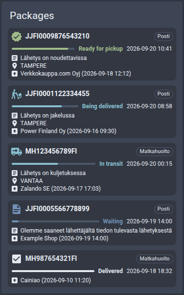

# Package tracking card

Home Assistant dashboard card that lists the packages coming to you, from any package tracking integration.

[![GitHub Release][releases-shield]][releases] [![GitHub Release Date][release-date-shield]][releases]

[![HACS][hacs-shield]][hacs] [![Home Assistant][home-assistant-shield]][home-assistant] [![License][license-shield]](LICENSE)

![Project Maintenance][maintenance-shield] [![GitHub Activity][commits-shield]][commits] [![Open bugs][bugs-shield]][bugs] [![Open enhancements][enhancements-shield]][enhancements]

## Support

Hey dude! Help me out for a couple of :beers: or a :coffee:!

[](https://www.buymeacoffee.com/jesmak)

## What is it?

A custom card that shows the packages on their way to you: how far each one has got, what happened to it last and
when. Packages still moving are listed first, with the most recently moved at the top, and finished ones fall to the
bottom. Clicking a package opens the carrier's own tracking page for it.

The card doesn't know any carrier. It reads a sensor's `packages` attribute, so any integration that writes its
packages in the [format below](#the-package-format) works, and one card can list packages from several of them
together. These integrations write it:

- [Posti package tracking](https://github.com/jesmak/posti_tracking)
- [Matkahuolto package tracking](https://github.com/jesmak/matkahuolto_tracking)
- [PostNord package tracking](https://github.com/jesmak/postnord_tracking)

Integrations that write the format carry the GitHub topic
[`package-tracker-card-source`](https://github.com/topics/package-tracker-card-source), so that's where to look for
more. If you make one, give its repository the topic too.



## Options

The card has a visual editor: add it from the card picker and choose the sensors. The options can also be written by
hand.

| Name                         | Type           | Requirement  | Description                                                 | Default              |
| ---------------------------- | -------------- | ------------ | ----------------------------------------------------------- | -------------------- |
| `type`                       | string         | **Required** | `custom:package-tracker-card`                               |                      |
| `entity`                     | string or list | **Required** | The sensor, or sensors, whose packages are listed           |                      |
| `title`                      | string         | Optional     | Shown at the top of the card                                |                      |
| `max_events`                 | number         | Optional     | List at most this many packages                             | all                  |
| `height`                     | number         | Optional     | A fixed height in pixels; the packages scroll inside it     | follows the packages |
| `max_height`                 | number         | Optional     | A height the card never grows past, in pixels               | none                 |
| `show_progress`              | boolean        | Optional     | Show how far the package has got, as a bar                  | `true`               |
| `show_pickup`                | boolean        | Optional     | Add the pickup deadline, or the estimate, to that line      | `true`               |
| `show_details`               | boolean        | Optional     | Show the weight and how many parcels the shipment has       | `false`              |
| `pickup_code`                | string         | Optional     | `hidden`, `always`, or `toggle` to reveal it when clicked   | `hidden`             |
| `show_origin`                | boolean        | Optional     | Show where the package was sent from                        | `true`               |
| `show_destination`           | boolean        | Optional     | Show where it is going, or where it is picked up            | `true`               |
| `show_latest_event`          | boolean        | Optional     | Show the status and when it last changed                    | `true`               |
| `show_latest_event_message`  | boolean        | Optional     | Show what the tracking service last said                    | `true`               |
| `show_latest_event_location` | boolean        | Optional     | Show where that happened                                    | `true`               |
| `hide_when_nothing_to_show`  | boolean        | Optional     | Leave the card out of the dashboard while nothing is coming | `false`              |

```yaml
type: custom:package-tracker-card
title: Lähetykset
entity:
  - sensor.posti_example_com
  - sensor.matkahuolto_example_com
max_events: 5
show_destination: false
hide_when_nothing_to_show: true
```

A line is left out when the package has nothing to put on it, so a package without a known place for its latest event
simply shows one line fewer. A sensor that isn't there is passed over, and the card says so if none of them are.

## What a package shows

The bar says how far the package has got, from waiting to delivered, and is coloured by its status: blue while the
carrier has it, green once it can be picked up, grey when it is done, red if it was returned or something went wrong.
Beside it are the status and the moment it last changed.

Under that are the lines you have left on: what the carrier last said, where that happened, who sent it and where it
is going. A chip names the service the package came from, which matters when one card lists several.

Clicking a package opens the tracking page its integration gives for it. A package without one isn't clickable.

## The destination line

One line says where the package is going and by when. The **pickup point** stands in for the destination whenever the
tracking integration sends one — they are the same place said twice — and the integration only sends it when its own
**Pickup point and code** setting is on.

A package that is still on its way shows its **estimated delivery**; one waiting at a pickup point shows **how long it
is kept** instead, because the estimate is of no more use once it has arrived. Not every carrier gives that deadline;
without one, a package waiting for pickup shows its place alone. A delivered package shows the place only.

`show_destination` hides the place and `show_pickup` the time, so turning off one leaves the other on its own line.

The pickup code collects the package, so it is never shown unless asked for. It sits beside the tracking service's
own message — the one that says the package can be collected — and falls back to the destination line when that
message is hidden:

| `pickup_code` | What it does                                                     |
| ------------- | ---------------------------------------------------------------- |
| `hidden`      | Never shown, whatever the integration sends                      |
| `always`      | Shown beside the status message                                  |
| `toggle`      | Covered with dots; clicking reveals it, clicking again covers it |

It needs the integration's setting as well, so switching it on takes both.

## The size of the card

Without `height` or `max_height` the card is as tall as its packages. With either of them the packages scroll inside
the card, and the title stays put above them. A height set another way — `card_mod`, or a section that sizes its
cards — works the same way: the card keeps to it instead of letting the text run outside.

## The package format

The card lists the packages of every sensor it is given, from the sensor's `packages` attribute: a list with one
object per package. Only `shipment_number` and `status` are required. Anything else may be left out or `null`, and
the line that would show it is left out too.

| Key                  | Type   | What the card does with it                                                                  |
| -------------------- | ------ | ------------------------------------------------------------------------------------------- |
| `shipment_number`    | string | **Required.** Shown as the package's name                                                   |
| `status`             | number | **Required.** One of the statuses below: the icon, the bar and the colour                   |
| `latest_event_date`  | string | When the status last changed, in ISO 8601. Shown with the status, and sorts the list        |
| `latest_event`       | string | What the carrier last said, in its own words                                                |
| `latest_event_city`  | string | Where that happened                                                                         |
| `origin`             | string | Who sent it; `origin_city` stands in when there is no name                                  |
| `origin_city`        | string | Where it was sent from                                                                      |
| `shipment_date`      | string | When it was sent, in ISO 8601. Shown after the sender                                       |
| `destination`        | string | Where it is going; `destination_city` stands in when there is no name                       |
| `destination_city`   | string | The city it is going to                                                                     |
| `estimated_delivery` | string | When it is expected, in ISO 8601. Shown until it can be picked up                           |
| `pickup_deadline`    | string | How long it is kept at the pickup point, in ISO 8601. Shown once it can be picked up        |
| `pickup_point`       | object | Where it is picked up: `name` and `city` are shown, in place of the destination             |
| `pickup_code`        | string | The code that collects it. Shown only as `pickup_code` allows                               |
| `weight`             | number | Kilograms, with `show_details`                                                              |
| `package_count`      | number | How many parcels the shipment has, with `show_details`                                      |
| `source`             | string | The service it came from, shown as a chip                                                   |
| `tracking_url`       | string | The carrier's page for the package, opened when it is clicked. Only `http` and `https` open |

The statuses:

| `status` | Meaning                 | `status` | Meaning            |
| -------- | ----------------------- | -------- | ------------------ |
| `0`      | Delivered               | `4`      | Being delivered    |
| `1`      | Waiting                 | `5`      | Ready for pickup   |
| `2`      | Received by the carrier | `6`      | Returned to sender |
| `3`      | In transit              | `7`      | Exception          |

Delivered and returned packages are finished: they sort below the rest. An integration that needs more of its own can
add keys; the card ignores what it doesn't know.

```json
{
  "shipment_number": "JJFI12345678901234567",
  "status": 5,
  "latest_event_date": "2026-09-16T08:30:00+00:00",
  "latest_event": "The shipment is ready for pickup",
  "origin": "Example Shop",
  "destination_city": "TAMPERE",
  "pickup_deadline": "2026-09-30T21:00:00+00:00",
  "pickup_point": { "name": "Example parcel locker", "city": "TAMPERE" },
  "source": "Example Carrier",
  "tracking_url": "https://carrier.example.com/track/JJFI12345678901234567"
}
```

## How to install

### With HACS

1. Add this repository to HACS custom repositories with type **Dashboard**
2. Search for Package tracker card in HACS and download it
3. Refresh your browser

### Manually

1. Take `dist/package-tracker-card.js` from the source code of the [latest release][releases] and copy it to the
   `config/www` folder of your Home Assistant installation
2. In Home Assistant settings, open dashboards, click the three dots at the top right and open resources
3. Add a new resource with the path `/local/package-tracker-card.js` and type JavaScript
4. Refresh your browser

## Upgrading from 1.x

The card keeps its configuration, and `name` is still accepted for the title. Clicking a package needs an integration
version that gives `tracking_url`; with an older one the packages are listed as before but don't open anything.

A package is now one row with a progress bar rather than a stack of icon lines, the card has a visual editor, and
`height` and `max_height` keep it inside a size you give it. The statuses "waiting" and "received by the carrier" were
the wrong way round before, and are now as the integrations mean them.

## Translating

The card's texts are in `src/localize/languages/`, one JSON file per language, named by its language code: `en.json`,
`fi.json`. To add a language, copy `en.json` to the new language's code, such as `sv.json`, and translate the values.
Nothing else needs changing: the card finds the file by itself and uses it when Home Assistant is set to that
language. A text left out falls back to English.

## Development

Requires Node 22.13 or newer.

```
npm install
npm run check
```

`npm run check` typechecks, lints, checks formatting, runs the tests and builds `dist/package-tracker-card.js`, which
is the file HACS installs and is committed to the repository.

| Path                          | What it contains                             |
| ----------------------------- | -------------------------------------------- |
| `src/package-tracker-card.ts` | The card itself                              |
| `src/editor.ts`               | The visual editor                            |
| `src/packages.ts`             | Reading, sorting and formatting the packages |
| `src/localize/languages/`     | The card's texts, one JSON file per language |
| `tests/`                      | Tests, run with vitest                       |

## Data

The packages come from the tracking integrations the card is given; the card itself fetches nothing.

[releases-shield]: https://img.shields.io/github/release/jesmak/package-tracker-card.svg?style=for-the-badge
[release-date-shield]: https://img.shields.io/github/release-date/jesmak/package-tracker-card?style=for-the-badge
[releases]: https://github.com/jesmak/package-tracker-card/releases
[hacs-shield]: https://img.shields.io/badge/HACS-Custom-orange.svg?style=for-the-badge
[hacs]: https://hacs.xyz/docs/faq/custom_repositories/
[home-assistant-shield]: https://img.shields.io/badge/Home%20Assistant-visual%20editor%20%2F%20yaml-green.svg?style=for-the-badge
[home-assistant]: https://www.home-assistant.io/
[license-shield]: https://img.shields.io/github/license/jesmak/package-tracker-card.svg?style=for-the-badge
[maintenance-shield]: https://img.shields.io/maintenance/yes/2026.svg?style=for-the-badge
[commits-shield]: https://img.shields.io/github/commit-activity/y/jesmak/package-tracker-card.svg?style=for-the-badge
[commits]: https://github.com/jesmak/package-tracker-card/commits/master
[bugs-shield]: https://img.shields.io/github/issues/jesmak/package-tracker-card/bug?style=for-the-badge&label=bugs&color=red
[bugs]: https://github.com/jesmak/package-tracker-card/labels/bug
[enhancements-shield]: https://img.shields.io/github/issues/jesmak/package-tracker-card/enhancement?style=for-the-badge&label=enhancements&color=blue
[enhancements]: https://github.com/jesmak/package-tracker-card/labels/enhancement
